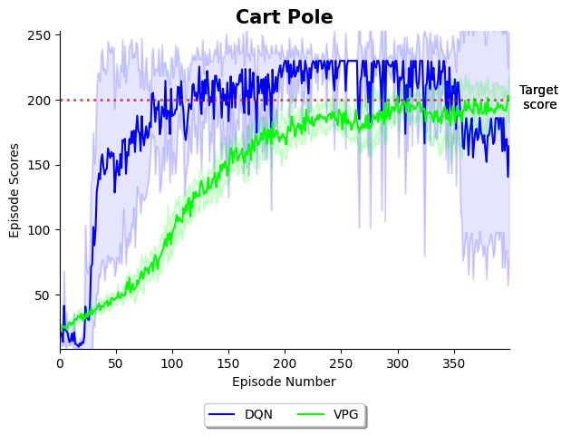

# DEEP REINFORCEMENT LEARNING ALGORITHMS
This repository contains PyTorch implementations of various Deep Reinforcement Learning algorithms and a comparison of
their results.

## Algorithms
The following algorithms have been implemented so far:

1. Vanilla Policy Gradient (VPG) based on [OpenAI's Spinning Up](https://spinningup.openai.com/en/latest/algorithms/vpg.html)
   1. using Generalized Advantage Estimation [(Schulman et al 2015)](https://arxiv.org/abs/1506.02438)
2. Deep Q Learning (DQN) based on [Mnih et al. 2013](https://arxiv.org/pdf/1312.5602.pdf)  

## Results
The algorithms were trained on OpenAI Gym's [implementation](https://www.gymlibrary.ml/environments/classic_control/cart_pole/) 
of the Cart Pole Environment. Each agent was trained for 400 training steps with episodes automatically terminating after 
230 timesteps. For the exact hyperparameters see [here](train_all_for_cartpole.py). The y value of the learning curves 
represents the mean score of running the algorithm 5 times and the shaded area around the learning curve corresponds to 
the standard deviation. 

Note that just looking at the learning curves is not sufficient to compare two algorithms. Firstly, the same amount of 
training steps does not necessarily require the same amount of computing power and training time. For example, DQN can do
a training step after every timestep after an initial period of exploration. On the other hand, VPN must complete multiple 
full episodes for every training step. Furthermore, no hyperparameter tuning was done before running the algorithms. Doing
so might significantly improve performance. Hence, the learning curves only serve to demonstrate the correct implementation
of the algorithms and their learning behaviour.

## Acknowledgements
Some code in this repository was inspired by the [Spinning Up repository](https://github.com/openai/spinningup)
and [Deep Reinforcement Learning Algorithms in PyTorch](https://github.com/p-christ/Deep-Reinforcement-Learning-Algorithms-with-PyTorch).
The implementation of the algorithms in this repository are my own, but it was immensely useful to look at their work when I was stuck or looking
for things to improve.

Spinning Up's [website](https://spinningup.openai.com/en/latest/index.html) is a great resource to learn about Reinforcement Learning.

This [post](https://towardsdatascience.com/generalized-advantage-estimate-maths-and-code-b5d5bd3ce737) by Rohan Tangri helped me understand 
Generalized Advantage Estimation.